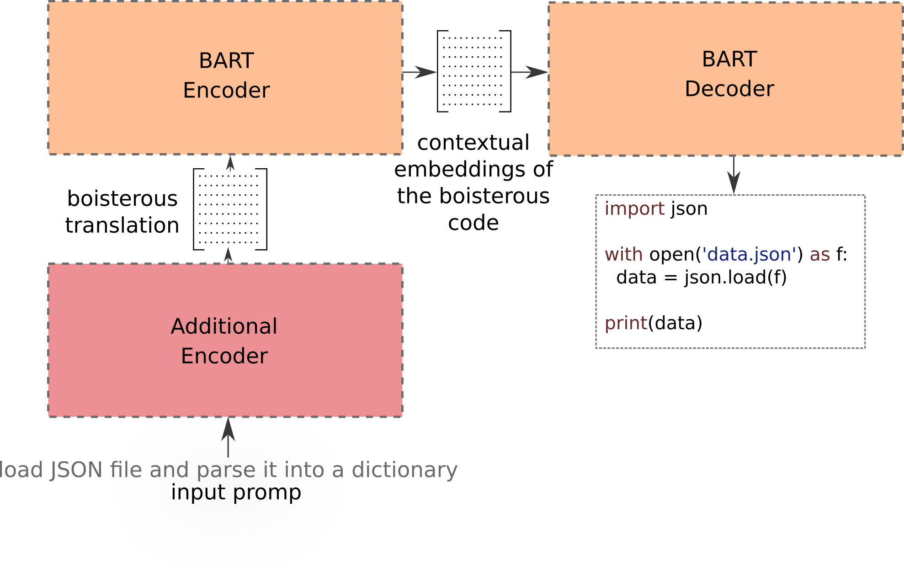

# CodeFormer

This repository is a product of a Master's thesis realized on the Faculty of Applied Sciences at the University of West Bohemia in 2022. The repository provides access to the resulting models and datasets.

## Abstract
_This work introduces CodeFormer, a Python source code generator pre-trained on a massive GitHub crawl consisting of 230M Python functions. The released model, built on BART architecture, generates Python functions based on descriptions in English. On a CodeSearchNet dataset, the CodeFormer sets a new state of the art with 46.12 BLEU, representing an improvement of 13.86 BLEU. We also release a new parallel corpus for code generation called Stack Overflow Code Generation Dataset (SOCGD), on which our model sets a baseline of 47.68 BLEU. The resulting model is ready to be integrated into a source code suggestion system in an IDE, where it can improve software developers' productivity. During our research, we discovered a better way of training the BART for machine translation. However, the applicability of our approach to other domains must be verified in subsequent work._

## Pre-trained CodeFormer

## Fine-tuned CodeFormer

- CodeFormer (w/ CodeBERT) for CodeSearchNet
- CodeFormer (w/ CodeBERT) for SOCGD
- CodeFormer (w/ MQDD) for CoNaLa

## Stack Overflow Code Generation Dataset (SOCGD)

## Pre-training Corpus

## Licence
This work is licensed under a Creative Commons Attribution-NonCommercial-ShareAlike 4.0 International License. http://creativecommons.org/licenses/by-nc-sa/4.0/

## How should I cite the CodeFormer? 

The work has not been yet published on a conference or university library. Therefore, correct citation will be added later. If you want to use this work, please contact us using email `pasekj{at}ntis.zcu.cz` to determine the correct citation to be used.
