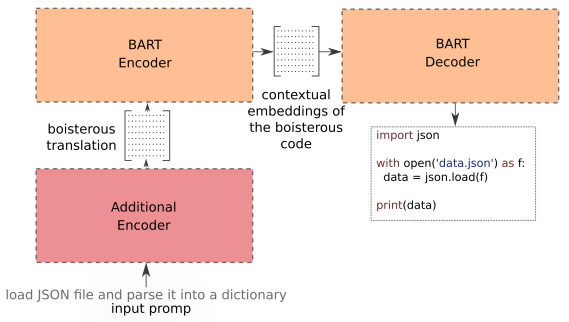

# CodeFormer

This repository is a product of a Master's thesis realized on the Faculty of Applied Sciences at the University of West Bohemia in 2022. The repository provides access to the resulting models and datasets.

**Author**: Jan Pašek (`pasekj{at}students.zcu.cz`)

**Supervisor**: Miloslav Konopík

## Abstract
_This work introduces CodeFormer, a Python source code generator pre-trained on a massive GitHub crawl consisting of 230M Python functions. The released model, built on BART architecture, generates Python functions based on descriptions in English. On a CodeSearchNet dataset, the CodeFormer sets a new state of the art with 46.12 BLEU, representing an improvement of 13.86 BLEU. We also release a new parallel corpus for code generation called Stack Overflow Code Generation Dataset (SOCGD), on which our model sets a baseline of 47.68 BLEU. The resulting model is ready to be integrated into a source code suggestion system in an IDE, where it can improve software developers' productivity. During our research, we discovered a better way of training the BART for machine translation. However, the applicability of our approach to other domains must be verified in subsequent work._



## Pre-trained CodeFormer

The pre-trained CodeFormer, which is based on the architecture of BART can be obtained using HuggingFace Transformers, using the following source code:

```Python
from transformers import AutoTokenizer, AutoModelForSeq2SeqLM
tokenizer = AutoTokenizer.from_pretrained("janpase97/codeformer-pretrained")

model = AutoModelForSeq2SeqLM.from_pretrained("janpase97/codeformer-pretrained")
```

## Fine-tuned CodeFormer

The architecture (see figure above) of a source code generator based on our CodeFormer model consists of a pre-trained CodeFormer ammended with an additional encoder. In our work we use either the CodeBERT or the MQDD as an additional encoder. The implementation of the model can be found in `code_former.py` file, where one can find an implementation of the `CodeFormer` for code generation.

To use the fine-tuned model, it is necessary to download a checkpoint from our GoogleDrive disk. You can select from three different versions of the model, each fine-tuned on a different dataset:  

- [CodeFormer (w/ CodeBERT) for CodeSearchNet](https://drive.google.com/drive/folders/1Cw-Agt8bVCm47bcd04hvxpl8m8hveput?usp=sharing)
- [CodeFormer (w/ CodeBERT) for SOCGD](https://drive.google.com/drive/folders/14E_I_6AswjyUg1Uw_v5vh7s5MTXXPmcV?usp=sharing)
- [CodeFormer (w/ MQDD) for CoNaLa](https://drive.google.com/drive/folders/15YiNsADgsGZsrICm35_zrD4QBEqISj57?usp=sharing)

After downloading the selected checkpoint, the model can be instantiated and loaded using the following source code snippet:

```Python
from code_former import CodeFormer

# TODO Choose correct additional encoder being used (based on the downloaded checkpoint)
# ADDITIONAL_ENCODER = "UWB-AIR/MQDD-pretrained"
ADDITIONAL_ENCODER = "microsoft/codebert-base"

model = CodeFormer("janpase97/codeformer-pretrained", ADDITIONAL_ENCODER)
ckpt = torch.load("model.pt",  map_location="cpu")
model.load_state_dict(ckpt["model_state_dict"])
```

## Stack Overflow Code Generation Dataset (SOCGD)

## Pre-training Corpus

The whole pre-training corpus consisting of approximately 230M Python function from public GitHub repositories can be dowloaded from the our GoogleDrive folder [here](https://drive.google.com/drive/folders/1giM1LAKlGBV1tfaitJ5ugf4lridKPvWj?usp=sharing). The pre-training corpus is distributed in the form of tokenized input examples. Each `*.dat` file can be loaded using `torch.load()` command, which results in reading a `List` of `torch.Tensor`, where each element represents a single training example. To retrieve the original source codes from the tokenized sequences, one shall use our WordPiece tokenizer, which can be loaded using the first source code snippet presented in this document.

## Licence
This work is licensed under a Creative Commons Attribution-NonCommercial-ShareAlike 4.0 International License. http://creativecommons.org/licenses/by-nc-sa/4.0/

## How should I cite the CodeFormer? 

The work has not been yet published on a conference or university library. Therefore, correct citation will be added later. If you want to use this work, please contact us using email `pasekj{at}students.zcu.cz` to determine the correct citation to be used.
